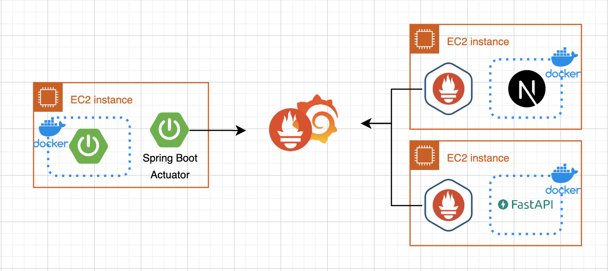

## **Languages**
    

    
## **Technologies**
    

 
 

# **📈 아키텍처**

  
본문 확인

  

    

- 단일 VPC 내에 퍼블릭/프라이빗 서브넷을 구성하고 NAT 인스턴스를 두어 보안과 확장성을 동시에 확보했습니다.
    - **퍼블릭 서브넷**: 프론트엔드 서버 및 NAT 인스턴스 배포.
    - **프라이빗 서브넷**: 백엔드, Jenkins, Redis, RDS 등 주요 서비스 배치.
    - **VPC 격리**: 퍼블릭/프라이빗 서브넷 분리로 외부 접근 차단.
    - **CORS 문제 해결:** 프론트엔드와 백엔드 간의 CORS 문제를 해결하기 위해, 프론트엔드의 ALB와 백엔드의 ALB에 각각 메인 도메인과 서브 도메인을 할당하여 동일 출처 정책을 만족시켰습니다. 이를 통해 클라이언트와 서버 간의 원활한 통신이 가능해졌습니다.
- **ECS**: 프론트엔드, 백엔드, AI 서비스를 컨테이너로 배포하며 ASG로 스케일 인/아웃 관리.
- **ALB**:
    - 프론트 ALB: Route 53을 통해 도메인 연결.
    - 백엔드 + AI ALB: 서브도메인으로 CORS 문제 해결.
- **CI/CD 파이프라인**: Jenkins에서 GitHub 푸시를 감지하여 Docker 이미지를 ECR에 업로드 후 ECS로 자동 배포.
- **모니터링 및 로그 관리**:
    - Prometheus와 Grafana로 메트릭 모니터링.
    - ELK 스택으로 로그 수집 및 시각화.

ECS와 ASG로 컨테이너를 배포 및 확장하며, ALB와 Route 53으로 도메인 연결과 CORS 문제를 해결했습니다. CI/CD로 배포를 자동화하고, Prometheus, Grafana, ELK 스택으로 모니터링과 로그 관리를 수행했습니다.

---

  
<b>구축한 AWS 환경의 주요 구성 요소</b>

  

프로젝트의 요구사항을 충족하고 효율적인 클라우드 환경을 구축하기 위해 AWS 인프라를 다음과 같이 구성하였습니다. 주요 목표는 **무중단 배포**, **트래픽 분산**, **컨테이너 배포 자동화**, 그리고 **리소스 확장성과 효율성**을 확보하는 것이었습니다.

---

## 배포 환경

### **1. 무중단 배포**

- ECS - **Rolling Update** 
새로운 애플리케이션 버전을 배포할 때 기존 태스크를 점진적으로 교체하며, 서비스 중단 없이 애플리케이션 업데이트가 가능합니다.

### **3. 컨테이너 배포 자동화**

- **ECS(Elastic Container Service) / ECR(Elastic Container Registry)**
    - ECS의 **시작 템플릿**과 **유저데이터**를 활용해 Auto Scaling Group에서 생성된 인스턴스가 ECR의 이미지를 받아 자동으로 애플리케이션을 실행할 수 있도록 구성했습니다.

### **2. 트래픽 분산**

- **Application Load Balancer(ALB)**
    - 다수의 Auto Scaling Group에 트래픽을 분산시켰습니다.
    - ALB는 들어오는 요청을 라우팅하고, 각 애플리케이션 인스턴스의 상태를 모니터링하여 비정상 인스턴스를 자동으로 제외합니다.

---

### **4. Auto Scaling 및 태스크 확장 로직**

[링크](#ansible에서-ecs로-전환한-이유)

### **5. 모니터링 및 로그 관리**

[링크](#prometheus--grafana)

### **6. 보안 강화**

- **AWS Systems Manager Parameter Store:**
    
    애플리케이션에서 사용하는 환경 변수와 민감한 데이터(예: 데이터베이스 접속 정보) 관리
    
    - ECS 태스크 정의의 containerDefinitions에서 **secrets**를 사용하여 민감한 값을 Parameter Store에서 직접 불러와 컨테이너의 환경 변수로 설정했습니다.
    - 이를 통해 민감한 데이터를 코드나 컨테이너 이미지에 포함하지 않고 안전하게 관리할 수 있었으며, 권한 관리와 감사 추적이 용이해졌습니다.
- **CORS 문제 해결:** 프론트엔드와 백엔드 간의 CORS 문제를 해결하기 위해, 프론트엔드의 ALB와 백엔드의 ALB에 각각 메인 도메인과 서브 도메인을 할당하여 동일 출처 정책을 만족시켰습니다. 이를 통해 클라이언트와 서버 간의 원활한 통신이 가능해졌습니다.

### **7. Jenkins를 활용한 CI/CD**

[링크](#jenkins-사용-이유)

---

위와 같은 아키텍처를 통해 프로젝트는 안정성과 확장성을 동시에 확보했습니다. 특히, ECS와 Auto Scaling Group을 연동하여 태스크 리소스가 부족할 경우 동적으로 인스턴스와 태스크를 추가할 수 있는 환경을 구축했습니다. 이를 통해 서비스의 무중단 배포와 트래픽 분산은 물론, 리소스 사용 효율성을 극대화할 수 있었습니다. AWS의 다양한 서비스 간 유기적인 연동으로 운영의 자동화와 효율성을 모두 달성하였습니다.

  

---

  

 
 

# **🔨 모니터링 및 유지보수**

  
본문 확인

  

    
## Log Monitor

---

- aws frontend-alb, backend&ai-alb
    
    
    
## Metric Monitor

- Spring Boot
    
    
    
- Docker cAdvisor container dashboard
    
    
    

## Slack Alert

- ECS - Service 배포 Alert

- Slack Alert - Jenkins health check

- slack alert - 컨테이너 리소스 사용량 알림

  

 
 

# **💎 왜 이 기술을 사용했는가?**

  
본문 확인

  

    
### jenkins 사용 이유
    

  
상세 내용

  

    

## Jenkins 사용 이유

프로젝트는 협업의 효율성을 극대화하기 위해 **GitHub Organization**을 활용하여 각 파트별 독립적인 레포지토리를 구성하고, CI/CD 자동화를 통해 개발 프로세스를 체계화하는 것을 목표로 삼았습니다. 이를 실현하기 위해 다음과 같은 이유로 Jenkins를 도구로 선정했습니다.
    

---
    
### terraform 사용 이유
    

  
상세 내용

  

        

## Terraform 사용 이유

AWS 기반의 인프라를 구축하며 우리 팀은 **일관성 유지**, **협업 효율성**, 그리고 **유지보수 편의성**을 최우선 과제로 삼았습니다.

하지만 콘솔을 통한 수작업 설정 방식은 오류 발생 가능성이 높고, 팀원이 실시간으로 작업 중인 수정 사항을 확인하기 어려운 한계가 있었습니다. 또한, 개발을 멈추는 시간 동안 불필요한 리소스를 계속 실행하면 비용이 낭비될 우려가 있었습니다. 이를 해결하기 위해 팀원 간의 협업을 강화하고, 인프라 관리를 체계화하며 비용 효율성을 높일 수 있는 코드 기반 도구인 Terraform을 도입하게 되었습니다.

---

Terraform 도입을 통해 팀은 인프라 관리의 체계화와 협업 효율성을 크게 향상시켰습니다. S3와 DynamoDB를 활용한 중앙 집중형 상태 관리는 작업 충돌을 방지하고 안정적인 협업 환경을 제공했습니다. 이를 통해 인프라 관리가 더욱 체계화되고, 팀의 협업과 운영 효율성이 전반적으로 개선되었습니다.
        
    
---

---
    
### ansible 대신 ecs 사용 이유
    

  
상세 내용

  

        
# ECS 사용 이유

배포 자동화와 서비스 가용성을 유지하기 위해 AWS Autoscaling을 도입했습니다. 처음에는 Autoscaling으로 생성된 인스턴스에 컨테이너를 배포하고 실행하기 위해 Ansible을 사용했습니다. 하지만, 매번 새로 생성된 인스턴스에 컨테이너를 띄우는 작업이 반복적이고 관리 부담이 컸으며, 배포 중 서비스 중단 가능성을 완전히 방지하기 어려운 문제가 있었습니다.

---

## **Ansible에서 ECS로 전환한 이유**

### **1. Autoscaling과 컨테이너 배포의 보완**

Ansible을 사용해 Autoscaling으로 생성된 인스턴스에 컨테이너를 띄우는 과정을 자동화하려 했지만, 매번 새로운 인스턴스에 대해 추가적인 스크립트나 수작업이 필요했습니다. 반면 ECS는 **유저 데이터와 시작 템플릿**을 활용해 Autoscaling과 자연스럽게 통합되며, 인스턴스가 생성되자마자 필요한 컨테이너를 자동으로 배포하고 실행할 수 있었습니다. 이를 통해 반복 작업의 부담이 줄어들고 운영 효율이 향상되었습니다.

### **2. 상태 관리와 자동화의 향상**

ECS는 클러스터 내 태스크 상태를 지속적으로 모니터링하며, 비정상적인 컨테이너를 자동으로 복구합니다. 이러한 상태 관리 기능은 Ansible로는 수동 작업이 필요했던 부분을 자동화할 수 있어 서비스 안정성을 보장할 수 있었습니다.

### **3. AWS 서비스와의 통합**

ECS는 AWS의 다양한 서비스와 긴밀하게 연동됩니다. ECR과 통합해 컨테이너 이미지를 관리하며, CloudWatch를 활용해 컨테이너 상태와 리소스 사용량을 실시간으로 모니터링할 수 있었습니다. 이러한 통합 기능은 Ansible로는 추가적인 설정과 작업이 필요했던 부분을 자동으로 처리할 수 있도록 지원했습니다.

---

## **EKS vs ECS**

ECS를 사용하던 중 Kubernetes 기반의 복잡한 컨테이너 관리를 지원하는 EKS의 존재를 확인했지만, 우리 프로젝트는 대규모 프로젝트에 해당하지 않는다고 판단했습니다. 이에 따라 복잡한 설정과 추가적인 학습이 필요한 EKS 대신, AWS에 최적화되어 간단한 설정만으로 컨테이너를 관리할 수 있는 ECS를 선택하게 되었습니다.
        
    
---

---
    
### Pronmetheus & Grafana

  
상세 내용

  

        
# **Prometheus & Grafana**

---

## **Prometheus와 Grafana 선택 이유**

프로젝트 진행 중 서버가 자주 다운되거나 ECS 컨테이너가 배포 중단되는 문제가 발생했습니다. 컨테이너와 인스턴스에서 리소스를 과도하게 사용하는게 원인이었지만, 이를 실시간으로 감지하거나 정확히 분석할 수 없었고 리소스 사용 데이터를 제대로 확보하지 못해 문제 해결에 어려움이 생겼습니다. 이러한 이유로 운영 효율성과 비용 관리에 부정적인 영향이 생겨서 Prometheus & Grafana를 사용 했습니다

---

## **ECS 컨테이너 및 인스턴스 분석**

ASG로 배포된 인스턴스에 CAdvisor, Node Exporter를 설치해 메트릭을 수집 했습니다. Prometheus를 사용해 인스턴스의 리소스 사용량 데이터를 수집하고, Grafana를 통해 시각화하여 시스템 상태를 확인 했습니다. 특정 임계치를 초과하는 리소스 사용량이 감지되면 slack으로 알람을 보내 신속히 장애를 해결하고, 리소스 사용량을 최적화 하였습니다.

        

---

### ELK
    

  
상세 내용

  

        

---

## **ELK 8.x 설치**

프로젝트 진행 중 ELK Stack을 활용하여 서버 로그를 수집하고 모니터링하기 위해, Elastic Agent와 같은 새로운 기능이 포함된 최신 버전인 **8.x**를 설치했습니다.

### 문제점

기존 **Filebeat** 대신 **Elastic Agent**를 사용하면 로그 수집과 모니터링 작업을 단일 에이전트로 통합할 수 있었습니다. 하지만 Elastic Agent는 **JSON 형식**의 구조화된 로그 처리에 최적화되어 있었으며, 비구조화된 로그 처리에는 추가적인 전처리 작업이 필요했습니다.

---

## **ALB 로그 수집 문제**

1. **ALB 로그의 형식**
    - ALB의 로그는 **가공되지 않은 메시지 형태**로 S3 버킷에 저장됨.
    - Elastic Agent는 이러한 비구조적 로그를 직접 처리하기 어렵고, Elasticsearch에 적합한 형식으로 변환하기 위해 전처리 작업 필요.
2. **Logstash를 활용한 전처리**
    - Logstash를 사용해 S3에 저장된 ALB 로그를 수집.
    - 로그를 필요한 형태로 전처리(파싱 및 필터링)한 후 Elasticsearch로 전달.

---

## **로그 수집 및 전처리 과정**

1. **S3에서 ALB 로그 수집**
    - **Logstash**를 통해 S3 버킷에 저장된 ALB 로그를 읽어옴.
2. **로그 전처리**
    - Logstash의 **Grok 필터**를 사용해 ALB 로그를 파싱.
    - 로그 메시지에서 필요한 정보를 추출하고, Elasticsearch에 적합한 JSON 형식으로 변환.
3. **Elasticsearch로 전송**
    - 전처리된 로그 데이터를 Elasticsearch로 전달해 저장 및 검색 가능하게 만듦.

---

## **결론**

ELK 8.x를 설치하며 Elastic Agent 도입을 검토했지만, 비구조화된 로그의 전처리가 필요한 상황에서는 Logstash를 활용하는 것이 적합했습니다. Logstash를 사용해 S3에 저장된 ALB 로그를 수집하고 전처리 과정을 거쳐 Elasticsearch로 전달했으며, 이를 통해 비구조화된 ALB 로그를 효과적으로 처리하고 ELK의 모니터링 기능을 최대한 활용할 수 있었습니다.

  

